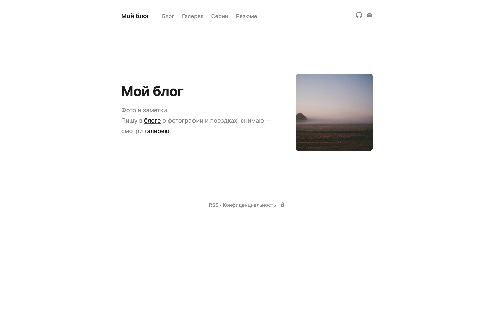
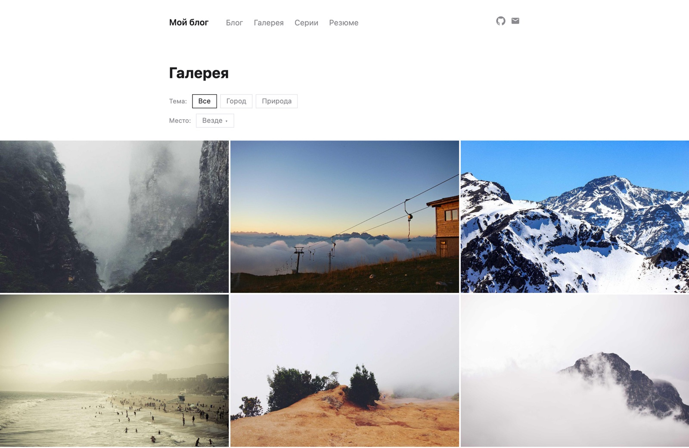
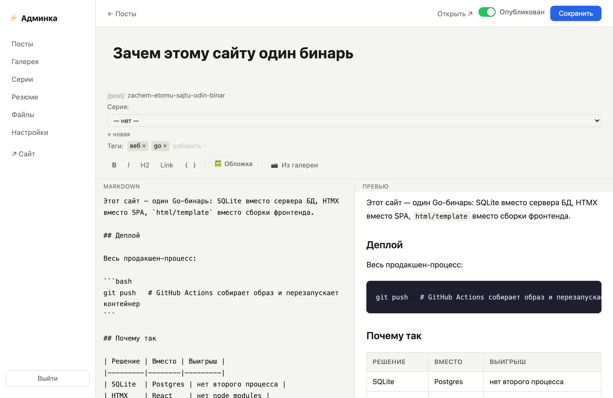

# dsite

[](https://github.com/demen1n/dsite/actions/workflows/ci.yml)
[](https://codecov.io/gh/demen1n/dsite)
[](https://goreportcard.com/report/github.com/demen1n/dsite)
[](https://github.com/demen1n/dsite/releases)
[](LICENSE)

A minimalist personal website engine: blog posts, photo gallery, resume.
Go + HTMX + SQLite. Single binary, zero runtime dependencies, no build step.

[Русская версия](README.ru.md)

## Screenshots

Home page and photo gallery with category/place filters:





Markdown editor with HTMX live preview:



## Quick start

```bash
INSECURE_COOKIES=true go run ./cmd/dsite
```

> `INSECURE_COOKIES=true` is needed when running over plain HTTP (localhost) —
> otherwise the session cookie has the `Secure` flag and the browser won't send
> it, so admin login won't work. Not needed in production behind an HTTPS proxy.

Open http://localhost:8080. On first run, visit `/admin/setup` to create the admin account.

## Environment variables

| Variable           | Default          | Description                                              |
|--------------------|------------------|----------------------------------------------------------|
| `PORT`             | `8080`           | Server port                                              |
| `DB_PATH`          | `./data.db`      | SQLite database path                                     |
| `UPLOADS_DIR`      | `./uploads`      | Uploads directory                                        |
| `SITE_TITLE`       | `My Blog`        | Site title                                               |
| `SITE_DESC`        | `Фото и заметки` | Site subtitle                                            |
| `SITE_URL`         | _(auto-detect)_  | Canonical base URL (e.g. `https://example.com`), used in sitemap/robots/feed. Set it in production. |
| `INSECURE_COOKIES` | —                | Set to `true` for local development over HTTP            |
| `TRUSTED_PROXY`    | —                | Set to `true` when behind a reverse proxy (trusts `X-Forwarded-For` for login rate limiting) |

## Docker

```bash
docker build -t dsite .
docker run -p 8080:8080 -v dsite_data:/data dsite
```

Or with compose: copy `docker-compose.example.yml` to `docker-compose.yml`,
adjust the values, and run `docker compose up -d`. Terminate TLS with any
reverse proxy (Caddy, nginx) in front and set `TRUSTED_PROXY=true`.

## Features

**Content**
- Posts with a markdown editor, HTMX live preview, tags, cover image and slug
- Post series with their own pages
- Photo gallery with categories, shooting locations and drag-and-drop ordering
- Resume page in markdown
- Editable home page (markdown, changed from settings without a rebuild)
- Atom feed (`/feed.xml`), `sitemap.xml`, `robots.txt`
- Full-text search (SQLite FTS5), works for Cyrillic too

**Admin**
- Uploads browser (`/admin/uploads`) — shows where each file is used, deletes unused ones
- Media picker for inserting images into posts
- Settings: site title, subtitle, home page text, social links, resume visibility
- Cyrillic-aware slugs (transliterated to Latin)

**Image uploads**
- Server-side resize/re-encode (EXIF-corrected, max 1600px, JPEG); GIFs stored as-is to preserve animation
- Magic-byte validation on top of an extension allowlist, random hex filenames
- Immutable `Cache-Control` for uploads (1 year)

**Security**
- CSRF protection (Origin/Referer check on POST)
- Login rate limiting (5 attempts / 15 min per IP)
- Security headers (CSP, X-Frame-Options, Referrer-Policy, etc.)
- Sessions in SQLite, 30-day expiry, scheduled cleanup

## Project structure

```
cmd/dsite/main.go          # Entry point: config, DB init, routing
internal/config/config.go  # Environment config
internal/db/
  db.go                    # SQLite init (WAL) + schema migrations
  queries.go               # All database operations (raw SQL, no ORM)
internal/handlers/
  helpers.go               # Templates, sessions, markdown, file uploads
  public.go                # Public pages
  admin.go                 # Auth + admin CRUD
internal/imgproc/          # Server-side image resize/re-encode
templates/                 # html/template with block inheritance
static/                    # CSS, JS, vendored HTMX — no build step
```

## Dependencies

- [`modernc.org/sqlite`](https://pkg.go.dev/modernc.org/sqlite) — pure-Go SQLite, no CGO
- [`github.com/yuin/goldmark`](https://github.com/yuin/goldmark) — Markdown → HTML (GFM)
- [`golang.org/x/crypto`](https://pkg.go.dev/golang.org/x/crypto) — bcrypt
- [HTMX](https://htmx.org) — vendored in `static/`, no CDN

## Backups

The SQLite file is the only copy of all content. Recommended:
[litestream](https://litestream.io/) streaming to S3-compatible storage, or at
minimum a cron job running `sqlite3 /data/data.db ".backup ..."` with rotation.

## License

[MIT](LICENSE)
